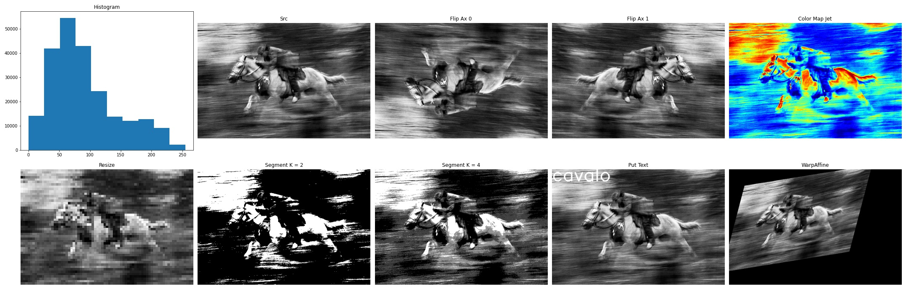

# Comum Operations

Repository with image processing comum operations



## Installation (Dependencies)

```sh
conda create -n comumoperations python=3.6
conda activate comumoperations
conda install -c menpo opencv
pip install matplotlib
```